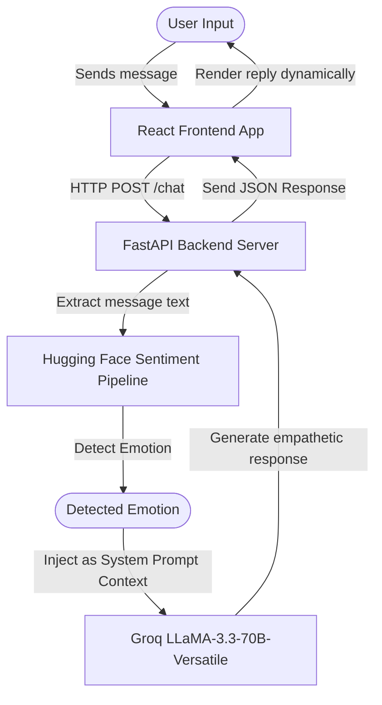

# Soul Sync AI ✨

Soul Sync AI is an emotionally intelligent AI companion chatbot application. By analyzing the sentiment and core emotions behind your messages, it responds with tailored, warm, and supportive answers to create a safe space for mental well-being and free expression.

---

## 🚀 How It Works

Here is a breakdown of the architecture and data flow of Soul Sync AI:



1. **Frontend App**: The user chats through a responsive, modern interface built in [App.jsx](file:///D:/Sem2Disha/jerry/emotion-ai/frontend/src/App.jsx) (styled with Tailwind CSS and CSS gradients).

2. **API Endpoint**: The frontend calls the backend's `/chat` endpoint using Axios.
3. **Emotion Detection**: The backend in [emotion.py](file:///D:/Sem2Disha/jerry/emotion-ai/backend/emotion.py) processes the text using a Hugging Face pipeline (`j-hartmann/emotion-english-distilroberta-base`) to identify the dominant emotion (e.g. *joy, sadness, anger, fear, surprise, disgust, neutral*).
4. **Context Injection**: The backend in [app.py](file:///D:/Sem2Disha/jerry/emotion-ai/backend/app.py) feeds this emotion into a customized system instruction.
5. **AI Generation**: Groq's fast LLaMA model processes the request and responds with emotional awareness.

---

## 🛠️ Project Structure

The project is divided into two primary workspaces:

* **[frontend/](file:///D:/Sem2Disha/jerry/emotion-ai/frontend)**: A React application initialized with Vite.
  * [src/App.jsx](file:///D:/Sem2Disha/jerry/emotion-ai/frontend/src/App.jsx) - Handles layout, chat history states, loading indicators, and user interactions.
  * [src/App.css](file:///D:/Sem2Disha/jerry/emotion-ai/frontend/src/App.css) - Contains custom styles for backdrop filters, glowing gradients, and chat animations.
* **[backend/](file:///D:/Sem2Disha/jerry/emotion-ai/backend)**: A Python FastAPI application.
  * [app.py](file:///D:/Sem2Disha/jerry/emotion-ai/backend/app.py) - The application controller setting up CORS middleware, the Groq LLaMA integration, and the `/chat` route.
  * [emotion.py](file:///D:/Sem2Disha/jerry/emotion-ai/backend/emotion.py) - The Hugging Face pipeline classifier utilizing PyTorch to detect the user's emotion.
  * [memory.py](file:///D:/Sem2Disha/jerry/emotion-ai/backend/memory.py) - Reserved workspace file for introducing chat history persistence or user profile memory.

---

## ⚙️ Installation & Running Locally

### 1. Backend Setup
Navigate to the `backend` folder, configure a Python virtual environment, install dependencies, and start the development server:

```bash
cd backend
python -m venv venv

# Activate virtual environment
# On Windows:
.\venv\Scripts\activate
# On macOS/Linux:
source venv/bin/activate

# Install requirements
pip install -r requirements.txt
```

#### Environment Variables
Create a `.env` file inside the `backend` folder (or edit the existing one) to specify your credentials:
```env
GROQ_API_KEY=your_groq_api_key_here
```

Start the backend application with Uvicorn:
```bash
uvicorn app:app --reload
```
The backend will run on `http://127.0.0.1:8000`.

---

### 2. Frontend Setup
Navigate to the `frontend` folder, install Node packages, and run the Vite dev server:

```bash
cd frontend
npm install
npm run dev
```
The frontend will launch (usually on `http://localhost:5173`). Open that URL in your browser to start chatting!

---

## 🎨 Technologies Used

- **Frontend**: React, Vite, Tailwind CSS, Axios.
- **Backend**: Python, FastAPI, Uvicorn, Python-dotenv.
- **AI/ML**: Hugging Face Transformers (`emotion-english-distilroberta-base`), PyTorch, Groq SDK (LLaMA-3.3-70b-versatile).